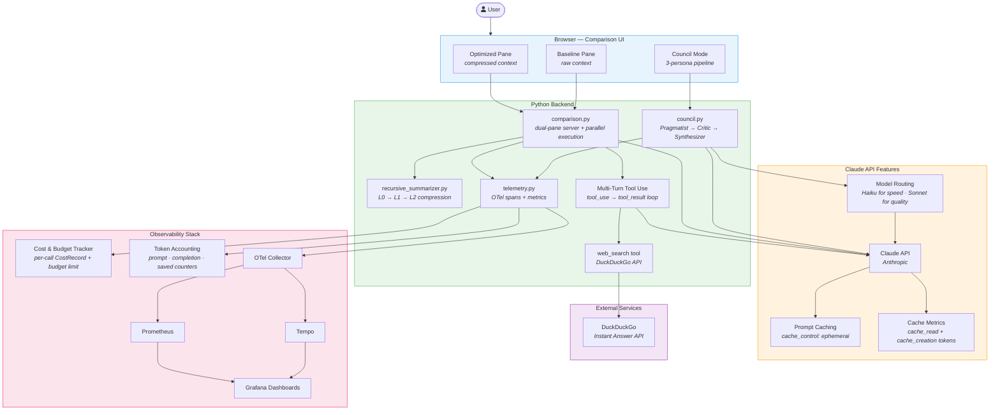

# AraFlow — Self-Optimizing AI Personal Assistant

> Built at Ara x Johns Hopkins Hackathon 2026

## What it does

AraFlow is a daily-life AI assistant that **gets smarter about itself**. It manages tasks, notes, and reminders while:

1. **Recursive Summarization** — Compresses conversation history hierarchically to stay within token budgets. Older messages get summarized, and summaries themselves get re-summarized as they accumulate.

2. **OpenTelemetry Instrumentation** — Every tool call and chat turn is traced as an OTel span. The assistant can analyze its own performance data and suggest workflow optimizations.

3. **Live Dashboard** — A real-time web UI shows token savings, tool performance, span timelines, and auto-generated optimization hints.

## Architecture



## Quick Start

```bash
pip install ara-sdk opentelemetry-api opentelemetry-sdk opentelemetry-exporter-otlp-proto-http
ara auth login           # use access code: ARAHOPKINS
ara run app.py           # single cloud run
ara deploy app.py --cron "0 8 * * *"  # daily 8 AM automation
```

## Demo

```bash
python demo.py           # simulates a day of usage + starts dashboard
# open http://localhost:8050
```

## Files

| File | Purpose |
|------|---------|
| `app.py` | Main Ara automation — 10 tools for tasks, notes, reminders, analytics |
| `telemetry.py` | OTel tracing, span logging, token accounting |
| `recursive_summarizer.py` | Hierarchical context compression engine |
| `dashboard.py` | Live web dashboard for workflow visualization |
| `demo.py` | Demo script that populates data and launches dashboard |

## Security

AraFlow integrates with external services (GitHub API, Claude API) using user credentials. We built security in from the start — not as an afterthought.

### Threat Model

| Threat | Impact | Mitigation |
|--------|--------|------------|
| **Token leakage in error responses** | Attacker recovers `GH_TOKEN` from stack traces | `_gh_api()` catches all HTTP errors and raises sanitized `RuntimeError` — raw exceptions with headers are never propagated to the client |
| **Network exposure of API endpoints** | Anyone on the network can trigger GitHub/Claude API calls | Server binds to `127.0.0.1` only — not accessible from other machines |
| **Credential exposure in telemetry** | `GH_TOKEN` or private repo data appears in OTel spans exported to Grafana/Tempo | `traced_tool` redacts kwargs matching sensitive key patterns (`token`, `password`, `secret`, `key`, `authorization`) and truncates result previews |
| **GitHub API quota exhaustion** | Attacker or runaway loop burns through 5,000 req/hr limit | Built-in rate limiter caps at 30 GitHub API calls/min with sliding window |
| **Private repo data in logs** | Repo names, issue titles, PR content logged in cleartext | Span `tool.result_preview` is truncated to 200 chars; sensitive field names are auto-redacted |

### Implementation Details

**Sanitized error handling** (`comparison.py`):
```python
def _gh_api(endpoint):
    try:
        ...
    except urllib.error.HTTPError as e:
        # Never expose Authorization header or raw response
        raise RuntimeError(f"GitHub API error: {e.code} {e.reason} for {endpoint}") from None
```

**Span redaction** (`telemetry.py`):
```python
_SENSITIVE_KEYS = {"token", "password", "secret", "key", "authorization", "private"}

def _safe_args_for_span(kwargs):
    safe = {}
    for k, v in kwargs.items():
        if any(s in k.lower() for s in _SENSITIVE_KEYS):
            safe[k] = "[REDACTED]"
        else:
            safe[k] = v
    return json.dumps(safe, default=str)
```

**Localhost-only binding** (`comparison.py`):
```python
server = HTTPServer(("127.0.0.1", port), ComparisonHandler)
```

**Rate limiting** (`comparison.py`):
```python
_gh_api_calls: list[float] = []
GH_RATE_LIMIT = 30  # max GitHub API calls per minute

def _gh_api(endpoint):
    now = time.time()
    _gh_api_calls[:] = [t for t in _gh_api_calls if now - t < 60]
    if len(_gh_api_calls) >= GH_RATE_LIMIT:
        raise RuntimeError("GitHub API rate limit reached")
    ...
```

### Design Principles

1. **Secrets never travel through tool kwargs** — `GH_TOKEN` is read once from the environment and used only inside `_gh_api()`. It is never passed as a function argument, so it can't accidentally appear in spans, logs, or error messages.

2. **Fail closed** — If `GH_TOKEN` is not set, GitHub tools are simply not offered to Claude. The system degrades to a normal chat without tools rather than erroring.

3. **Defense in depth** — Even if one layer fails (e.g., an unexpected exception format), the localhost binding prevents network-level access, and the rate limiter prevents abuse.

## Key Innovation

Most AI assistants burn through tokens replaying full conversation history. AraFlow uses a **recursive summarization tree** — like a B-tree for conversation context — that keeps the active token window small while preserving important information. The OTel layer then lets you **see and optimize** how the assistant actually works.
